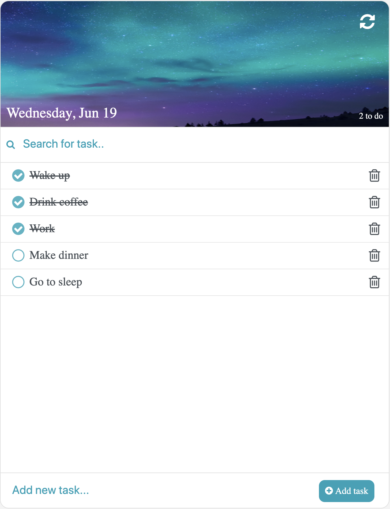
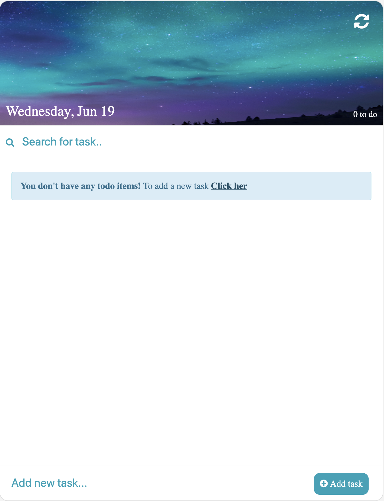

# To-Do list application
This todo application was developed using HTML/CSS and JavaScript. The application utilizes the web storage to save your tasks, which allows you to close the application without losing your to-do list.  

## Features 
* Create a new to-do tasks 
* Mark a tasks as completed
* Search for task 
* Delete a single task
* Delete all tasks
* Show number of unfinished to-do task
* Display date

## Install
* Download source-code
* Install JavaScript modules `$ npm install`
* Open `index.html`
